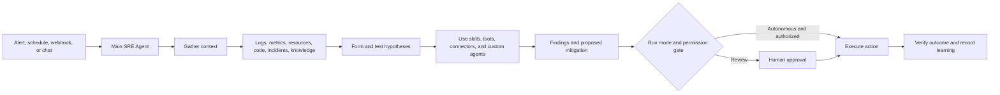

# Azure SRE Agent - Demo Guide

**Demo date:** August 6, 2026  
**Audience:** SRE, platform engineering, cloud operations, application owners, and leadership  
**Product status:** Generally Available (GA)

> **One-sentence summary:** Azure SRE Agent is an AI-powered operations teammate that connects telemetry, Azure resources, incident systems, source code, and operational knowledge to investigate issues, explain root cause, recommend or execute mitigations, and automate recurring reliability work within configured permissions and guardrails.

## Executive takeaway

Azure SRE Agent is not just a chatbot over Azure Monitor. It is an agentic operations service that can reason across signals, call tools, run investigations, retain operational context, route work to specialists, and take approved actions.

The most important deployment principle is:

> **The agent's deployment location is not the same as its operational scope.**

An agent is created as an Azure resource in one subscription, resource group, and region. Its operational reach is determined by the Azure RBAC granted to its managed identity and by the external systems connected to it.

A single agent can cover multiple workloads, resource groups, and subscriptions. That does not mean one agent should automatically cover an entire enterprise. Start with one agent for a related application or platform boundary, then split agents when ownership, permissions, data residency, risk, or operational context differ.

---

## 1. What is Azure SRE Agent?

Azure SRE Agent helps operations teams reduce incident-response time and repetitive operational toil. It works alongside engineers by combining:

- Azure service and SRE domain knowledge
- Natural-language interaction
- Access to live resource configuration, metrics, logs, alerts, and code
- Tool use through Azure capabilities, connectors, Python, skills, and MCP servers
- Persistent memory and knowledge from previous investigations
- Automation through incidents, schedules, and event-driven triggers
- Governance through Azure RBAC, tool permissions, hooks, audit telemetry, and approval modes

It is designed to answer questions such as:

- What changed before this outage?
- Which services and customers are affected?
- What is the most likely root cause, and what evidence supports it?
- Which mitigation is safest right now?
- Can this known recovery action be performed after approval?
- Are reliability, compliance, cost, or capacity risks emerging before an incident occurs?

### What it is not

- It is not a replacement for monitoring, alerting, or observability platforms.
- It is not automatically an unrestricted administrator for Azure.
- It is not guaranteed to be correct; AI conclusions and proposed changes still require appropriate validation and guardrails.
- It is not a substitute for service ownership, SLOs, tested runbooks, or sound incident management.

---

## 2. Core capabilities

| Capability | What it does | Example |
|---|---|---|
| Incident investigation | Correlates alerts, logs, metrics, resource state, deployments, and code | Relate an error-rate spike to a recent commit and configuration change |
| Root-cause analysis | Forms and tests hypotheses, then presents evidence and affected scope | Identify memory pressure caused by a bad deployment |
| Mitigation | Recommends or performs authorized actions | Restart a pod, scale a resource, or roll back a deployment |
| Interactive operations | Answers grounded questions about the environment | "What changed in production in the last hour?" |
| Scheduled operations | Runs recurring natural-language tasks | Daily health check, weekly cost review, certificate-expiry scan |
| Incident automation | Routes matching incidents to a suitable custom agent | Send P1 database incidents to a database specialist |
| Deep context | Uses source code, architecture, runbooks, postmortems, and persistent memory | Apply a team's known recovery procedure and escalation policy |
| Extensibility | Adds skills, custom agents, Python tools, hooks, and MCP integrations | Connect Datadog, Dynatrace, Splunk, ServiceNow, or an internal API |
| Collaboration | Publishes findings to existing systems | Update PagerDuty or ServiceNow and notify Teams |
| Closed-loop engineering | Connects operational findings to development workflows | Open a contextual GitHub issue for a durable code fix |

### Azure services it can work with

Through Azure Resource Manager, Azure Resource Graph, Azure CLI, Azure Monitor, and service-specific tools, the agent can investigate a broad range of services, including:

- Compute: VMs, App Service, Container Apps, AKS, and Functions
- Data: Azure SQL, Cosmos DB, PostgreSQL, MySQL, Redis, and Storage
- Network: VNets, NSGs, load balancers, and Application Gateway
- Observability: Azure Monitor, Log Analytics, and Application Insights

The actual actions available depend on identity permissions, network reachability, enabled tools, and the selected run mode.

---

## 3. How Azure SRE Agent works

A typical incident flow is:

1. **Trigger:** An Azure Monitor, PagerDuty, or ServiceNow incident arrives, or an operator starts a chat.
2. **Context gathering:** The agent queries live resources, logs, metrics, incident history, deployment data, repositories, and knowledge files.
3. **Reasoning:** It correlates evidence, develops hypotheses, and tests likely causes by calling tools.
4. **Specialization:** It can use a relevant skill or delegate focused work to custom agents.
5. **Recommendation:** It explains the likely root cause, impact, evidence, and proposed mitigations.
6. **Permission check:** Every tool call is evaluated against identity permissions, tool policy, hooks, and the configured run mode.
7. **Action:** In **Review** mode, write actions wait for approval. In **Autonomous** mode, an adequately permissioned agent can act without human approval.
8. **Verification and learning:** The agent validates recovery, updates the incident, and retains useful operational context.

### Security model in brief

- Each agent has an isolated sandbox for tool execution.
- A managed identity provides Azure access through RBAC.
- Short-lived credentials are supplied per tool call by an identity sidecar and are not placed in the reasoning context.
- Outbound calls pass through a validating network proxy.
- Agent operations can be sent to the customer's Application Insights resource for audit and troubleshooting.
- Reader access and Review mode are the recommended pilot starting point.

---

## 4. What is the scope of an agent?

There are three different scopes to understand.

### 4.1 Deployment scope

The SRE Agent resource itself is created in:

- One Azure tenant
- One owning subscription
- One resource group
- One supported Azure region

The deployment also uses or creates a managed identity, Application Insights, and usually a Log Analytics workspace.

### 4.2 Azure operational scope

The resources the agent can inspect or manage are determined by Azure RBAC assigned to its managed identity.

| Azure level | Supported approach | Practical meaning |
|---|---|---|
| Individual resource | Possible through direct RBAC, but usually too granular to operate | Narrowest reach; high administrative overhead |
| Resource group | First-class setup choice and recommended starting boundary | Access applies to resources in selected groups |
| Subscription | First-class setup choice for Reader access | Agent can discover and investigate all resources in selected subscriptions |
| Management group | Not presented as a first-class SRE Agent setup scope in current documentation | Azure RBAC can inherit from management-group assignments, but validate this design and use least privilege before enterprise rollout |
| Tenant | Not an automatic blanket scope | The agent is tenant-bound by identity; access must be explicitly granted to subscriptions/resources |
| Cross-tenant | Advanced design, not automatic | Requires delegated access, for example Azure Lighthouse, plus suitable RBAC and connector authentication |

The onboarding experience can add **subscriptions** or **resource groups**, including selections across subscriptions where the deploying user is allowed to create role assignments.

### 4.3 Connected-system scope

Azure RBAC does not govern every external system. GitHub, Azure DevOps, PagerDuty, ServiceNow, Teams, Datadog, Dynatrace, Splunk, and custom MCP servers have their own authentication and authorization scopes.

Therefore:

> **Effective agent scope = Azure RBAC + connector permissions + network reachability + enabled tools + run mode.**

### Reader versus Privileged

| Permission level | Purpose | Recommended use |
|---|---|---|
| Reader | Query resources, configurations, logs, and metrics; no direct Azure modification | Start here for discovery, investigations, and pilots |
| Privileged | Allows authorized operational changes | Add only for tested use cases and tightly scoped resources |

Permission level and run mode solve different problems. RBAC determines whether an action is technically allowed; **Review** or **Autonomous** determines whether human approval is required before the action runs.

---

## 5. Is one agent enough for an entire subscription?

### Short answer

**Technically, often yes. Architecturally, it depends.** A single agent can monitor multiple resources and workloads in its configured scope, and Microsoft explicitly notes that consolidating workloads under one agent can reduce always-on cost.

### Start with one agent when

- The workloads have the same owning or on-call team.
- They share incident processes, observability, repositories, and runbooks.
- The same RBAC and autonomy policy is appropriate for all resources.
- They have similar data-residency and network requirements.
- A common operational knowledge base improves investigations.
- The pilot needs a simple, low-cost starting point.

### Use multiple agents when

- Production and nonproduction need strict isolation.
- Different teams own different services or budgets.
- Workloads need different privileged permissions or autonomy levels.
- Business units have different compliance, tenant, residency, or network boundaries.
- The knowledge, connectors, and instructions would become noisy or contradictory.
- A regulated or high-risk workload needs a smaller blast radius.
- Separate cost attribution or lifecycle management is required.

### Recommended enterprise pattern

Do not default to "one agent per resource" or "one agent for the whole tenant." Use an **application, platform, or operational ownership boundary**.

A sensible rollout is:

1. One Reader-mode agent for one production application or platform and its nonproduction counterpart.
2. Connect only the essential telemetry, code, incident system, and runbooks.
3. Measure investigation quality, AAU use, MTTR, false conclusions, and operator acceptance.
4. Add narrowly scoped write permissions and Review-mode mitigations.
5. Split or expand agents based on ownership, risk, context quality, and observed cost.

---

## 6. Main configuration options

| Option | Decision to make |
|---|---|
| Model provider | Anthropic or Azure OpenAI, subject to region, tenant eligibility, data-boundary needs, and current availability |
| Azure resources | Select resource groups or subscriptions and assign Reader or narrowly scoped privileged access |
| Run mode | **Review** for approval before actions; **Autonomous** for trusted automation |
| Incident platforms | Azure Monitor Alerts, PagerDuty, or ServiceNow |
| Response plans | Filter by severity, service, incident type, or title, then route to a custom agent and run mode |
| Scheduled tasks | Define recurring health, compliance, cost, capacity, deployment, or SLA checks in natural language |
| Connectors | Add telemetry, code, knowledge, notifications, incident systems, and custom MCP services |
| Skills | Package repeatable procedures that the agent selects automatically when relevant |
| Custom agents | Add focused domain specialists with selected tools and optional handoff chains |
| Python tools | Implement custom calculations, transformations, and API logic |
| Knowledge files | Add architecture, runbooks, SOPs, postmortems, and service documentation |
| Memory | Retain synthesized operational learning across investigations |
| Hooks and tool permissions | Enforce deterministic or LLM-evaluated policy before or after tool execution |
| Network mode | Use unrestricted, limited, or VNet-integrated execution according to private endpoint and egress needs |
| Consumption limit | Set a monthly active-flow AAU allocation and monitor usage by thread type |

### Skills versus custom agents versus knowledge

| Use | Choose |
|---|---|
| A repeatable procedure the main agent should discover automatically | Skill |
| A specialist with focused instructions and tools | Custom agent |
| Reference material that should ground answers | Knowledge file |
| A connection to an external system or API | Connector or MCP server |
| A policy or lifecycle action around tool execution | Hook |

---

## 7. Governance and adoption checklist

Before enabling autonomous remediation, confirm:

- [ ] Named service owner and agent administrator
- [ ] Clear application or platform boundary
- [ ] Reader-first RBAC with least-privilege exceptions
- [ ] Review mode for new response plans and scheduled tasks
- [ ] Tested rollback and verification steps
- [ ] Incident filters that prevent irrelevant alerts from consuming agent time
- [ ] Curated architecture, runbooks, escalation rules, and known-failure guidance
- [ ] Connector identities scoped in their source systems
- [ ] Audit telemetry connected and reviewed
- [ ] VNet integration where private-only resources or controlled egress require it
- [ ] Monthly AAU limit and Azure Cost Management alerting
- [ ] Success measures: MTTR, investigation time, toil removed, approval rate, recurrence, and cost per resolved task

### Important limitations and considerations

- AI-generated diagnoses can be wrong or incomplete; validate evidence and proposed actions.
- English is currently the supported chat-interface language.
- Service and model availability vary by region and tenant configuration.
- Anthropic models have separate eligibility and data-boundary considerations; Azure OpenAI is the documented option for applicable EU Data Boundary requirements.
- Resources may be in regions different from the agent's deployment region, subject to permissions and connectivity.
- Stopping an agent stops active work but does **not** stop the fixed always-on charge; deleting it stops all SRE Agent billing.

---

## 8. Pricing

> **Pricing snapshot checked August 6, 2026. Always verify the Azure pricing page and your agreement before making a purchasing decision.**

Azure SRE Agent is billed in **Azure Agent Units (AAUs)**. Public US list pricing is currently **$0.10 per AAU** and has two components.

### 8.1 Always-on flow: fixed baseline

- Rate: **4 AAUs per agent-hour**
- Public US list cost: `4 AAUs x $0.10 = $0.40 per agent-hour`
- Approximate 30-day month: `4 x 24 x 30 = 2,880 AAUs = $288`
- Approximate 730-hour billing month: `4 x 730 = 2,920 AAUs = $292`

Always-on billing starts when the agent is created and continues until it is deleted. Stopping the agent does not remove this charge.

### 8.2 Active flow: variable, token-based usage

Active flow is charged whenever the agent is processing work, including chat, incidents, scheduled tasks, triggers, and asynchronous investigations. Waiting for human input is not active-flow usage.

Current documented AAUs per one million tokens:

| Model | Input | Output | Cache read | Cache write |
|---|---:|---:|---:|---:|
| Claude Opus 4.6 | 100 | 500 | 10 | 125 |
| GPT 5.3 Codex | 35 | 280 | 3.5 | 0 |
| GPT 5.2 | 35 | 280 | 3.5 | 0 |

Illustrative documented scenarios at public US list pricing:

| Scenario | Claude Opus 4.6 | GPT 5.3 Codex |
|---|---:|---:|
| Quick question | ~3.8 AAUs / **$0.38** | ~1.3 AAUs / **$0.13** |
| Incident investigation | ~35.3 AAUs / **$3.53** | ~11.7 AAUs / **$1.17** |
| Full remediation | ~86.5 AAUs / **$8.65** | ~30.1 AAUs / **$3.01** |

These are examples, not fixed task prices. Actual use depends on context size, task complexity, reasoning steps, tool results, caching, and the configured provider.

### 8.3 Example monthly estimate

For one agent in a 30-day month using GPT 5.3 Codex for 20 example incident investigations and 100 example quick questions:

| Component | Calculation | Estimate |
|---|---:|---:|
| Always-on | `2,880 AAUs x $0.10` | $288.00 |
| Investigations | `20 x 11.7 AAUs x $0.10` | $23.40 |
| Quick questions | `100 x 1.3 AAUs x $0.10` | $13.00 |
| **Estimated SRE Agent total** | **3,244 AAUs** | **$324.40/month** |

This estimate excludes separate charges that can include Azure Monitor ingestion and retention, Application Insights, Log Analytics, data egress, and third-party products or integrations.

### Cost controls

- Set an active-flow monthly AAU allocation in **Settings > Agent consumption**.
- Filter incidents so only relevant alerts trigger investigations.
- Batch routine checks as scheduled tasks instead of frequent polling.
- Test prompts and automation in chat or the playground before scheduling them.
- Give the agent concise, high-quality context to avoid wasteful exploration.
- Consolidate related workloads when governance permits, because every additional agent has an always-on baseline.
- Delete unused agents; stopping them removes active usage but not the baseline charge.

There is currently no SRE Agent free tier. Azure offers and agreement discounts may change the effective price.

---

## 9. Suggested live demo flow

### Demo objective

Show the agent moving from a symptom to evidence, root cause, controlled mitigation, and verification in one investigation thread.

### Before the demo

- Confirm the agent is running and its consumption limit has headroom.
- Confirm Azure resources, telemetry, repository, and incident connectors are healthy.
- Use Reader access or Review mode for the first demonstration.
- Prepare a reversible failure with enough telemetry to diagnose.
- Keep a known-good recovery command available as a fallback.
- Open **Settings > Managed resources**, **Builder > Connectors**, and the incident/chat view in separate tabs.

### Talk track and actions

1. **Show the agent resource:** Point out its owning subscription, resource group, region, model provider, and managed identity.
2. **Show managed resources:** Explain that these RBAC assignments, not the agent resource group, define Azure reach.
3. **Show context:** Display connected telemetry, code repository, and knowledge/runbook content.
4. **Introduce the failure:** Trigger an application, VM, AKS, database, deployment, or configuration issue.
5. **Start investigation:** Use the incident trigger or ask:  
   `Investigate the current service degradation. Identify impact, correlate recent changes, test the most likely causes, and propose the lowest-risk mitigation. Do not make changes without approval.`
6. **Inspect the evidence:** Highlight log queries, metrics, resource state, deployment correlation, and cited code or runbooks.
7. **Review the proposal:** Ask for alternatives, risk, rollback, and success criteria.
8. **Approve one safe action:** Demonstrate the permission gate and auditability.
9. **Verify recovery:** Ask the agent to confirm health against the original symptom and summarize the incident timeline.
10. **Show learning and automation:** Turn the proven procedure into a skill, response plan, or scheduled check.
11. **Close with consumption:** Show the thread's AAU usage and explain fixed versus variable cost.

### Useful follow-up prompts

- `What evidence would falsify your root-cause hypothesis?`
- `Show the affected resource scope and any dependencies you have not checked.`
- `Compare this incident with similar previous investigations.`
- `Propose a mitigation, rollback plan, verification checks, and expected customer impact.`
- `What permissions would be required to automate this safely?`
- `Create a post-incident summary with timeline, root cause, mitigation, and prevention actions.`

---

## 10. Questions the audience is likely to ask

### Does the agent replace the on-call engineer?

No. It reduces investigation and execution toil, preserves context, and can automate approved workflows. Humans remain responsible for service ownership, risk decisions, governance, and exceptional situations.

### Can it make changes automatically?

Yes, when the agent has sufficient RBAC and the response plan or task uses Autonomous mode. Start new workflows in Review mode and promote only well-tested, reversible actions.

### Can it work outside Azure?

Yes. MCP and managed connectors can integrate external observability, incident, collaboration, code, and custom systems. Access depends on each connector's credentials and network path.

### Can it see every resource in the subscription by default?

No. It sees resources authorized through its managed identity. Subscription-wide Reader can be granted, or access can be limited to selected resource groups.

### Can one agent access multiple subscriptions?

Yes. Add selected subscriptions or resource groups and grant the agent's managed identity the required RBAC on each scope.

### Can one agent cover multiple tenants?

Not by default. Cross-tenant operation is an advanced scenario that requires explicit delegation, such as Azure Lighthouse, plus RBAC and connector configuration.

### Does stopping an agent stop billing?

It stops active processing and active-flow consumption, but the fixed always-on charge continues. Delete the agent to stop SRE Agent billing completely.

### Is customer data used to train the models?

Microsoft's current FAQ states that customer data is not used to train AI models. Review the current data privacy, model-provider, and organizational compliance documentation for your deployment.

---

## 11. Recommended pilot

Run a two-to-four-week pilot around one well-observed service:

1. Deploy one agent in a supported region.
2. Grant Reader access to only the application's resource groups.
3. Connect Azure Monitor/Application Insights, the source repository, and the incident platform.
4. Add the architecture document, top runbooks, escalation policy, and recent postmortems.
5. Use Review mode and test five to ten representative incidents.
6. Add one low-risk scheduled task and one narrowly filtered response plan.
7. Measure MTTR, engineer time saved, diagnostic accuracy, recurrence, operator approval rate, and AAU cost.
8. Decide whether to expand the scope, add privileged actions, or split agents by ownership boundary.

A successful pilot proves not merely that the agent can answer questions, but that it can produce repeatable, evidence-grounded operational outcomes within acceptable cost and risk.

---

## Official references

- [Azure SRE Agent product page](https://www.azure.com/sreagent)
- [Azure SRE Agent documentation](https://learn.microsoft.com/azure/sre-agent/)
- [Product overview](https://learn.microsoft.com/azure/sre-agent/overview)
- [Create and set up an agent](https://learn.microsoft.com/azure/sre-agent/create-and-set-up)
- [Manage permissions](https://learn.microsoft.com/azure/sre-agent/manage-permissions)
- [Security overview](https://learn.microsoft.com/azure/sre-agent/security-overview)
- [Connectors](https://learn.microsoft.com/azure/sre-agent/connectors)
- [Custom agents](https://learn.microsoft.com/azure/sre-agent/sub-agents)
- [Incident response plans](https://learn.microsoft.com/azure/sre-agent/incident-response-plans)
- [Scheduled tasks](https://learn.microsoft.com/azure/sre-agent/scheduled-tasks)
- [Pricing and billing](https://learn.microsoft.com/azure/sre-agent/pricing-billing)
- [Azure SRE Agent pricing page](https://azure.microsoft.com/pricing/details/sre-agent/)
- [Official labs and community resources](https://github.com/microsoft/sre-agent)

---

*This document is a demo aid, not a contractual description of service behavior or price. Azure features, model availability, regions, limits, and rates can change. Validate the portal, Microsoft Learn, Azure pricing calculator, and your Azure agreement before production rollout.*
